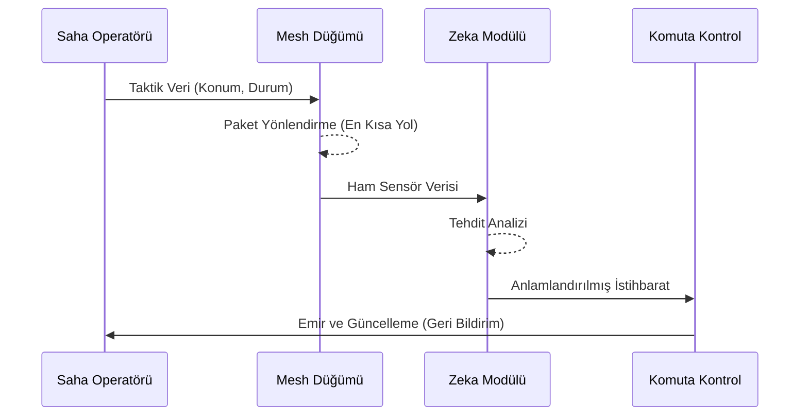

# OKTA Sistem Mimarisi

Özel Kuvvetler Teknoloji Ağı (OKTA), modern harp sahasının dinamik ve zorlu koşullarında kesintisiz iletişim, durumsal farkındalık ve karar destek mekanizmaları sağlamak için tasarlanmış çok katmanlı bir mimaridir.

## 1. Mimari Katmanlar

Mimari, ISO/OSI modeline benzer ancak taktik ihtiyaçlara göre optimize edilmiş 5 ana katmandan oluşur:

### 1.1. Fiziksel ve Donanım Katmanı (Physical Layer)
- **Cihazlar**: SDR (Software Defined Radio), LoRa modülleri, taktik akıllı cihazlar, drone kitleri.
- **Güç Yönetimi**: Ultra düşük güç tüketimi, enerji hasadı (energy harvesting) uyumluluğu.

### 1.2. Örgü Ağ Katmanı (Mesh Networking Layer)
- **Protokol**: OKTA-Mesh.
- **Özellikler**: Kendi kendini iyileştirme (self-healing), dinamik yönlendirme, düşük bant genişliğinde yüksek güvenilirlik.
- **Topoloji**: Merkeziyetsiz, her operatör bir röle ve düğüm görevi görür.

### 1.3. Veri ve Güvenlik Katmanı (Data & Security Layer)
- **Şifreleme**: Uçtan uca (E2EE) AES-256-GCM.
- **Kimlik Doğrulama**: Zero-trust politikaları, biyometrik ve donanım tabanlı anahtarlar.
- **Senkronizasyon**: CQRS ve Event Sourcing tabanlı veri tutarlılığı.

### 1.4. Zeka ve İşleme Katmanı (Intelligence Layer)
- **Kenar Bilişim (Edge AI)**: Görüntü işleme ve tehdit algılama yerel cihazlarda yapılır.
- **Sensör Füzyonu**: GPS, IMU, Lidar ve optik verilerin birleştirilmesi.

### 1.5. Sunum ve Etkileşim Katmanı (Presentation Layer)
- **Taktik Arayüz**: AR (Artırılmış Gerçeklik) HUD desteği, düşük ışık modu uyumlu dashboard.
- **C2 Dashboard**: Komuta kontrol merkezi için gerçek zamanlı operasyonel resim.

## 2. Veri Akış Şeması

## 3. Ölçeklenebilirlik ve Dayanıklılık

- **Bağımsızlık**: Merkezi sunucu gerektirmez; ağın bir kısmı kopsa dahi kalan kısımlar kendi içinde çalışmaya devam eder.
- **Gizlilik**: Emisyon kontrolü (EMCON) uyumlu sinyal basımı.
